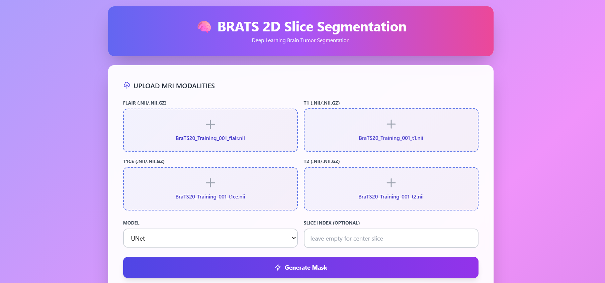
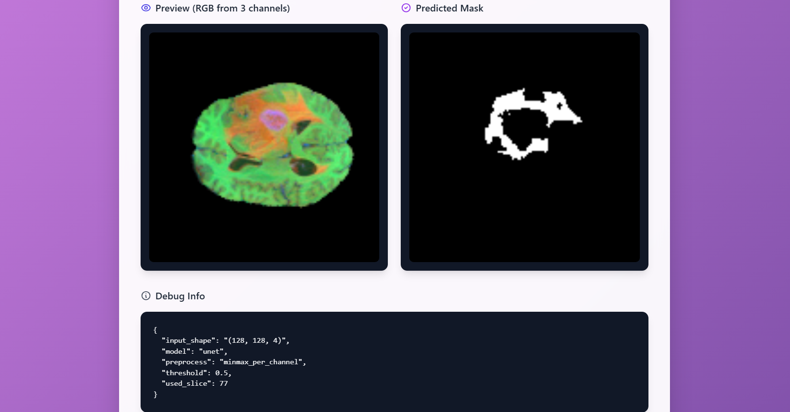

<p align="center">
  
</p>


<p align="center">

  <!-- Core stack -->
  <a href="https://www.python.org/">
    
  </a>

  <a href="https://flask.palletsprojects.com/">
    
  </a>

  <a href="https://www.tensorflow.org/">
    
  </a>

  <a href="LICENSE">
    
  </a>

  

  <!-- Platforms -->
  <a href="https://www.microsoft.com/windows">
    
  </a>

  <a href="https://www.kernel.org/">
    
  </a>

  <!-- Models -->
  <a href="https://arxiv.org/abs/1505.04597">
    
  </a>

  <a href="https://arxiv.org/abs/1511.00561">
    
  </a>

  <a href="models/minisegnet/">
    
  </a>

</p>

<p align="center">

  <!-- Stars -->
  <a href="https://github.com/Priyanshu-S-G/BTS_Webapp/stargazers">
    
  </a>

  <!-- Forks -->
  <a href="https://github.com/Priyanshu-S-G/BTS_Webapp/forks">
    
  </a>

  <!-- Repo Size -->
  <a href="https://github.com/Priyanshu-S-G/BTS_Webapp">
    
  </a>

  <!-- Open Issues -->
  <a href="https://github.com/Priyanshu-S-G/BTS_Webapp/issues">
    
  </a>

  <!-- Last Commit -->
  <a href="https://github.com/Priyanshu-S-G/BTS_Webapp/commits/main">
    
  </a>

</p>


# 🧠 BRATS 2D Slice Segmentation

**Deep-learning web demo: 4-channel MRI → binary brain tumor mask (UNet / SegNet / MiniSegNet)**

[Training notebook](https://github.com/Priyanshu-S-G/BTS_Webapp/tree/main/notebooks)

---

## Table of Contents

* [About](#about)
* [Features](#features)
* [Demo Screenshots & GIF](#demo-screenshots--gif)
* [Tech Stack](#tech-stack)
* [Repository Structure](#repository-structure)
* [Quick Start](#quick-start)
* [How It Works](#how-it-works)
* [Preprocessing Pipeline (critical)](#preprocessing-pipeline-critical)
* [Model Details](#model-details)
* [API Documentation](#api-documentation)
* [Troubleshooting](#troubleshooting)
* [Known Limitations & Medical Disclaimer](#known-limitations--medical-disclaimer)
* [Future Improvements](#future-improvements)
* [References & Credits](#references--credits)
* [License](#license)

---

## About

**BRATS 2D Slice Segmentation** is a lightweight Flask web-demo that performs brain tumor segmentation from 4‑modal MRI slices (FLAIR, T1, T1CE, T2) using pretrained deep-learning models. This repository repurposes trained models from a BRATS training pipeline and provides a rapid, reproducible local inference UI for testing and demonstrations.

This project was prepared for the IMD‑AI course / hackathon and focuses on a clean, reproducible inference flow (not a clinical tool).

---

## Features

* Upload four MRI modalities in BRATS order: **FLAIR**, **T1**, **T1CE**, **T2**
* Select model: **UNet**, **SegNet**, **MiniSegNet**
* Optional slice index (default = center slice)
* Preview (RGB composite from channels 0–2) + predicted binary mask (PNG)
* Preprocessing identical to the training notebook (resize, per‑channel min–max normalize)
* Works on CPU (TensorFlow) — optional GPU support if environment available
* No files written to disk by the server (uploads use temporary files and inference is in-memory)

---

## Demo Screenshots & GIF

*Example UI & outputs are shown below.*

<p align="center">
  
  
</p>

* **Screenshot**: the UI shows four upload widgets (one per modality), model selector, optional slice index, and the preview + mask outputs.

<p align="center">
  
</p>

---

## Tech Stack

| Component          | Purpose                               |
| ------------------ | ------------------------------------- |
| Flask              | Backend web server and API            |
| TensorFlow / Keras | Model loading & inference             |
| nibabel            | Read `.nii` / `.nii.gz` MRI files     |
| OpenCV (cv2)       | Resize + basic image ops              |
| NumPy              | Tensors & numerical ops               |
| Pillow             | Create PNG previews and masks         |
| HTML / JS          | Frontend UI (index.html + predict.js) |

---

## Repository Structure

```
BTS_Webapp/
├── app/
│   ├── app.py                # Flask app wiring
│   ├── preprocess.py        # NIfTI loader, slice extraction, resize & normalize
│   ├── inference.py         # model loading (cached), predict, mask->PNG helpers
│   ├── utils.py             # small helpers (allowed ext, metadata loader)
│   ├── templates/
│   │   └── index.html       # frontend
│   └── static/js/predict.js # frontend JS
├── models/
│   ├── unet/
│   │   ├── unet.keras
│   │   └── unet_training_history.csv
│   ├── segnet/
│   └── minisegnet/
├── notebooks/
│   └── BraTS_kaggle.ipynb
├── requirements.txt
├── README.md
└── .gitignore
```

**Notes:**

* Do **not** commit large model weights or raw `.nii` files. The repo contains `*.csv` histories and notebooks; models are added manually under `models/` during deployment.

---

## Quick Start

**From repo root**:

```bash
# create venv
python -m venv venv
# activate (Windows/Git Bash)
source venv/Scripts/activate
# install deps
pip install -r requirements.txt
# run server
python app/app.py
```

Open your browser at: `http://127.0.0.1:5000`

**Usage:** upload the four files in this exact order: `flair, t1, t1ce, t2`. Leave slice index empty for center slice. Choose model and click **Generate Mask**.

---

## How It Works

1. Frontend sends `multipart/form-data` POST to `/predict` with files: `flair, t1, t1ce, t2`, optional `slice_index`, and `model` name.
2. Server accepts files and saves them to temporary files (needed for reliable nibabel .nii loading on Windows).
3. `preprocess.py` extracts the same slice index from every modality, stacks into `(H,W,4)` with channel order **[FLAIR, T1, T1CE, T2]**, resizes to `(128,128)`, and applies per‑channel min–max normalization.
4. `inference.py` loads the selected Keras model (cached), runs `model.predict` on a batch of size 1, thresholds the sigmoid output at `0.5`, and returns a binary mask.
5. Server encodes both a 3‑channel preview PNG (channels 0..2 mapped to RGB) and the binary mask PNG into base64 and returns JSON with `preview_b64`, `mask_b64`, and debug info.

---

## Preprocessing Pipeline (critical — must match training)

**Channel order** (required):

```
[FLAIR, T1, T1CE, T2]
```

**Steps applied in inference (must match training notebook):**

1. If user uploads 4 separate `.nii` volumes, load each volume and extract the same slice index from each (default = center slice).
2. Stack the 2D slices into `(H, W, 4)` where the last axis follows the channel order above.
3. Resize each channel independently to `128 × 128` using bilinear interpolation (`cv2.INTER_LINEAR`).
4. Convert to `float32` and apply per‑channel min–max normalization:

```python
ch = ch.astype(np.float32)
ch = ch - ch.min()
ch = ch / (ch.max() + 1e-8)
```

5. Ensure final tensor shape: `(128, 128, 4)` (channels‑last). This is the model input.

**Important:** If you trained a model with a different preprocessing (z‑score, crop, different input size) update the `preprocess.py` accordingly or provide a `models/<model>/metadata.json` to instruct the server.

---

## Model Details

**UNet**

* Input: `128×128×4` channels‑last
* Output: single‑channel sigmoid mask
* Training: binary crossentropy + dice metrics (see notebook)

**SegNet** and **MiniSegNet**

* Alternative architectures (lighter/faster)
* Use same preprocessing for inference

**Model placement**

Put model files under `models/<model_name>/` with one of the supported filenames: `model.keras`, `model.h5`, or exactly `<model_name>.keras`.
Optionally include `custom_objects.py` in the model folder if your model uses custom loss/metrics.

**Optional `metadata.json` template**

```json
{
  "model_file": "unet.keras",
  "input_shape": [128,128,4],
  "channel_order": ["FLAIR","T1","T1CE","T2"],
  "preprocess": "minmax_per_channel",
  "threshold": 0.5
}
```

---

## API Documentation

**POST** `/predict`

**Form fields:**

* `flair` — file (required)
* `t1` — file (required)
* `t1ce` — file (required)
* `t2` — file (required)
* `model` — string (optional, default `unet`)
* `slice_index` — integer (optional)

**Response:** JSON

```json
{
  "preview_b64": "<base64 PNG>",
  "mask_b64": "<base64 PNG>",
  "debug": {
    "model": "unet",
    "input_shape": "(128, 128, 4)",
    "used_slice": 77,
    "preprocess": "minmax_per_channel",
    "threshold": 0.5
  }
}
```

To display returned images on the frontend, set `img.src = 'data:image/png;base64,' + preview_b64`.

---

## Troubleshooting

* **`TypeError: argument should be a str or os.PathLike, not BytesIO`** — fixed by writing uploaded bytes to a temporary file before calling `nib.load()` (this repository implements that workaround).

* **Blank or noisy masks** — common causes:

  * Channel order mismatch (ensure uploads follow **FLAIR, T1, T1CE, T2**)
  * Different normalization used in training vs inference (z‑score vs min‑max)
  * Wrong slice index (use center slice to test)

* **Model not found** — ensure model file exists under `models/<model_name>/` with supported filename.

* **Slow inference** — TensorFlow on CPU can be slow for large models. Use a smaller model (MiniSegNet) or install GPU TF.

---

## Known Limitations & Medical Disclaimer

* This repository is a **research/demo** tool. It is **not** a clinical product and must not be used for medical diagnosis or treatment.
* The pipeline is 2D slice based (not volumetric 3D segmentation). This can produce discontinuities across slices.
* Input resizing to `128×128` reduces spatial detail — fine for demos but may reduce clinical utility.
* Models trained on BRATS 2020; performance on other datasets / real patient data may vary.

---

## Possible Future Improvements

* Overlay mode (mask blended over FLAIR preview)
* Full-volume 3D UNet inference
* Dockerfile + GPU support
* Model management UI (upload models via UI)
* Batch/CLI inference mode
* Add unit tests + CI for model loading and preprocessing

---

## References & Credits

* BRATS 2020 dataset — training data used for model training
* UNet: Ronneberger et al., 2015
* SegNet: Badrinarayanan et al., 2017
* This repository adapted from a Kaggle training pipeline (notebooks: `https://github.com/Priyanshu-S-G/BTS_Webapp/tree/main/notebooks`)

---

## License

MIT License — see `LICENSE` file.

---

## Contact

Built by **Priyanshu** as an academic project.
